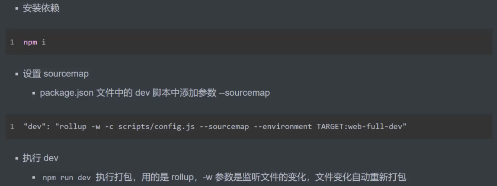
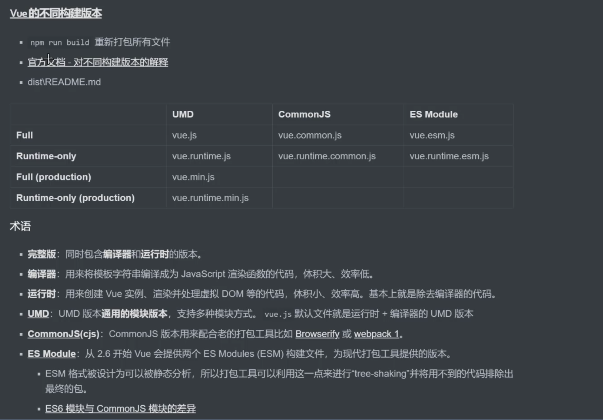
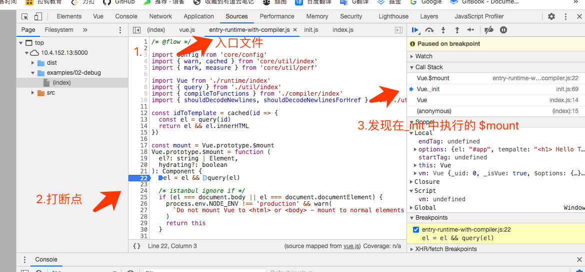
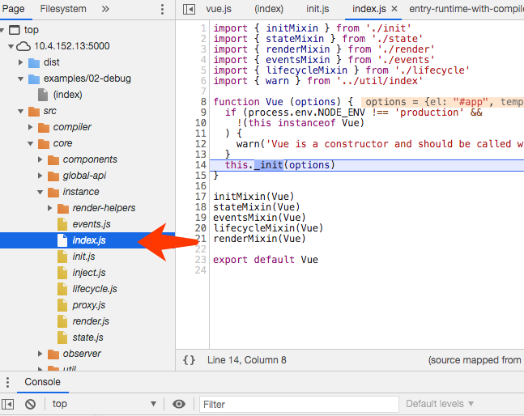
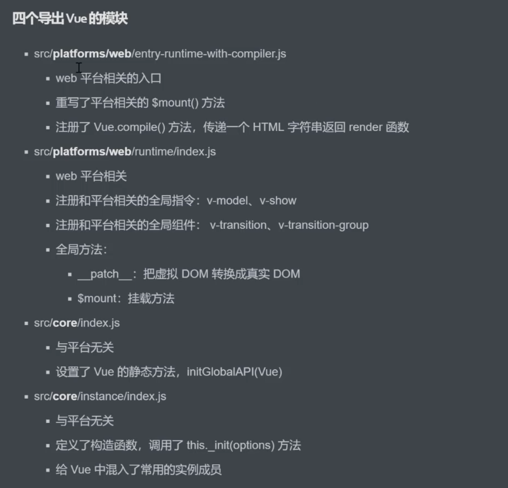
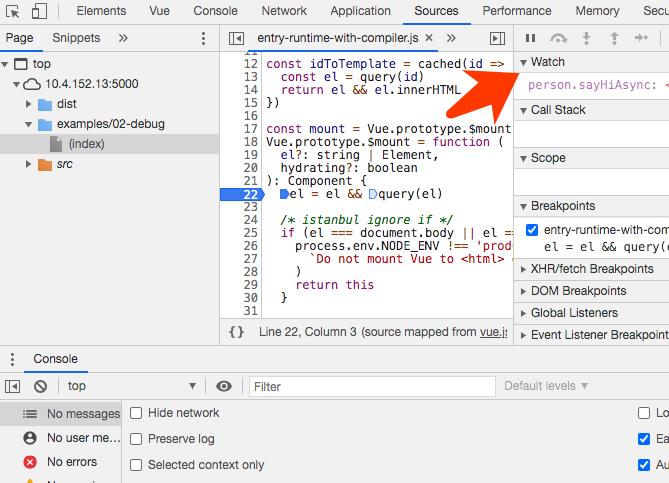

####  1.课程目标

- vue.js 的静态成员和实例成员初始化过程
- 首次渲染的过程
- 数据响应式原理

#### 2.准备工作-目录结构


#### 3.准备工作-调试



sources 面板中的src 目录，只有开启代码地图时才会有

> 断点调试，按F5进入断点调试

#### 4.准备工作-Vue的不同构建版本



- vue-cli 创建的项目，可以在命令行工具中通过 `vue inspect` 查看webpack 配置；

- webpack 中 `vue$` , ​`$` 是精确匹配；

- 基于vue-cli 的项目是用 vue 的运行时版本；

- 编译版本vue 就是 把template 编译成render函数；

#### 5.寻找入口文件

- `rollup -w -c scripts/config.js --sourcemap --environment TARGET:web-full-dev`

- scripts/config.js 中 `module.exports = genConfig(process.env.TARGET)`  genConfig 配置入口文件

- `src/platforms/web/entry-runtime-with-compiler.js` 入口文件

  > 看源码要从整体上看，不用一行一行的看

#### 6.从入口开始

1. render 与 template 先执行谁？

   如果render 传入则执行render函数，不传入render则执行template函数

2. $mount 是在Vue._init 里面调用的，查看方法如下：

   - 运行一个vue 例子

     ```html
     <!DOCTYPE html>
     <html lang="en">
     <head>
       <meta charset="UTF-8">
       <meta name="viewport" content="width=device-width, initial-scale=1.0">
       <meta http-equiv="X-UA-Compatible" content="ie=edge">
       <title>Document</title>
     </head>
     <body>
       <div id="app">
         Hello World
       </div>
       <script src="../../dist/vue.js"></script>
       <script>
           const vm = new Vue({
             el:'#app',
             tempalte:'<h1> Hello Template</h1>',
             render(h){
               return h('h1', 'Hello Render')
             }
           })
       </script>
     </body>
     </html>
     ```

   - 在入口文件中打断点 查找

     


3. Vue 的构造函数在哪？



#### 7.Vue 初始化的过程



#### 8.Vue 初始化-两个问题

- vscode 插件 babel javascript  能高亮flow 、ts 等

- Settings.json

  `javascript.validate.enable:false` // 设置不检查js 的语法问题，防止flow报错

#### 9.Vue 初始化-静态成员

​	`initGlobalAPI`方法给Vue 注册静态成员

#### 10.Vue初始化-实例成员

#### 11.Vue初始化-实例成员-init

#### 12.Vue初始化-实例成员-initState

​		Watch 用来监听 变量 变化的

​	 

#### 13.调试Vue初始化过程

#### 14.首次渲染过程

#### 15.首次渲染过程-总结

#### 16.数据响应式原理-响应式处理入口

#### 17.数据响应式原理-Observer

#### 18.数据响应式原理-defineReactive

#### 19.数据响响应式原理-依赖收集

#### 20.数据响应式原理-依赖收集-调试

#### 21.数据响应式原理-数组

#### 22.数据响应式原理-数组联系

#### 23.数据响应式原理-Watcher上

1. Watcher 类
   - Watcher 分三种，Computed Watcher、用户Watcher（侦听器）、渲染Watcher
   - 渲染Watcher 的创建时机 在 `src/core/instance/lifecycle.js`

#### 24.数据响应式原理-Watcher下

#### 25.数据响应式原理-调试上

#### 26.数据响应式原理-调试下

#### 27.数据响应式原理-总结

#### 28.动态添加一个响应式属性

#### 29.set-源码

#### 30.set-调试

#### 31.delete

#### 32.delete-源码

#### 33.watch-回顾

#### 34.三种类型的Watcher

#### 35.watch-源码

#### 36.nextTick-回顾

#### 37.nextTick-源码