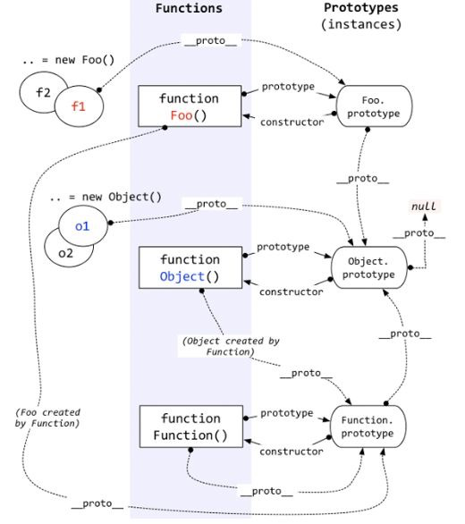

#### 1.原型定义：

1. 每个函数都会创建一个 prototype 属性，这个属性是一个对象，包含应该由特定引用类型的实例 共享的属性和方法。

2. 无论何时建一个函数，就会按照特定的规则为这个函数创建一个 prototype 属性（指向原型对象）。默认情况下，所有原型对象自动获得一个名为 constructor 的属性，指回与之关联的构造函数。

   > 脚本中没有访问这个[[prototype]]特性的标准方式，但是Firefox、Safari和Chrome会在每个对象上暴露`__proto__ `属性，通过这个属性可以访问对象的原型。



#### 2.判断一个对象是否存在另一个对象的原型链中

##### 1.`isProtoTypeOf()`

语法：`prototypeObj.isPrototypeOf(object)`

```javascript
function object1() {}
function object2() {}

object1.prototype = Object.create(object2.prototype);

const object3 = new object1();

console.log(object1.prototype.isPrototypeOf(object3));
// expected output: true

console.log(object2.prototype.isPrototypeOf(object3));
// expected output: true
```

##### 2.`instanceof` 

语法：`object instanceof constructor`

```javascript
// defining constructors
function C() {}
function D() {}

let o = new C()

// true, because: Object.getPrototypeOf(o) === C.prototype
o instanceof C

// false, because D.prototype is nowhere in o's prototype chain
o instanceof D

o instanceof Object           // true, because:
C.prototype instanceof Object // true

C.prototype = {}
let o2 = new C()

o2 instanceof C  // true

// false, because C.prototype is nowhere in
// o's prototype chain anymore
o instanceof C

D.prototype = new C()  // add C to [[Prototype]] linkage of D
let o3 = new D()
o3 instanceof D        // true
o3 instanceof C        // true since C.prototype is now in o3's prototype chain
```

> `isPortotypeOf() ` 与 `instanceof` 的区别是：
>
> `isPrototypeOf()` differs from the [`instanceof`](https://developer.mozilla.org/en-US/docs/Web/JavaScript/Reference/Operators/instanceof) operator. In the expression "`object instanceof AFunction`", the `object` prototype chain is checked against `AFunction.prototype`, not against `AFunction` itself.

##### 3.`instancof` 实现

```javascript
function instance_of(L, R) {//L 表示左表达式，R 表示右表达式 
    var O = R.prototype;   // 取 R 的显示原型 
    L = L.__proto__;  // 取 L 的隐式原型
    while (true) {    
        if (L === null)      
             return false;   
        if (O === L)  // 当 O 显式原型 严格等于  L隐式原型 时，返回true
             return true;   
        L = L.__proto__;  
    }
}
```

#### 3.获取对象的原型

##### `Object.getPrototypeOf()` 

The **`Object.getPrototypeOf()`** method returns the prototype (i.e. the value of the internal `[[Prototype]]` property) of the specified object.

```javascript
const prototype1 = {};
const object1 = Object.create(prototype1);

console.log(Object.getPrototypeOf(object1) === prototype1);
```

#### 4.判断属性是在实例上还是在原型对象上

>  只要给对象实例添加一个属性，这个属性就会遮蔽（shadow）原型对象上的同名属性，也就是虽然
> 不会修改它，但会屏蔽对它的访问。即使在实例上把这个属性设置为 null，也不会恢复它和原型的联
> 系。不过，使用 **delete** 操作符可以完全删除实例上的这个属性，从而让标识符解析过程能够继续搜索
> 原型对象。

##### 1.`hasOwnProperty()`   

判断属性是否在实例上

##### 2.`in` 操作符 

判断属性是否在实例的原型链上

```javascript
function Person() {} 
Person.prototype.name = "Nicholas"; 
Person.prototype.age = 29; 
Person.prototype.job = "Software Engineer"; 
Person.prototype.sayName = function() { 
 console.log(this.name); 
}; 
let person1 = new Person(); 
let person2 = new Person(); 
console.log(person1.hasOwnProperty("name")); // false 
console.log("name" in person1); // true 
person1.name = "Greg"; 
console.log(person1.name); // "Greg"，来自实例
console.log(person1.hasOwnProperty("name")); // true 
console.log("name" in person1); // true 
console.log(person2.name); // "Nicholas"，来自原型
console.log(person2.hasOwnProperty("name")); // false 
console.log("name" in person2); // true 
delete person1.name; 
console.log(person1.name); // "Nicholas"，来自原型
console.log(person1.hasOwnProperty("name")); // false 
console.log("name" in person1); // true
```

##### 3.确定某个属性是否在原型上

```javascript
function hasPrototypeProperty(object, name){ 
 return !object.hasOwnProperty(name) && (name in object); 
}
```


