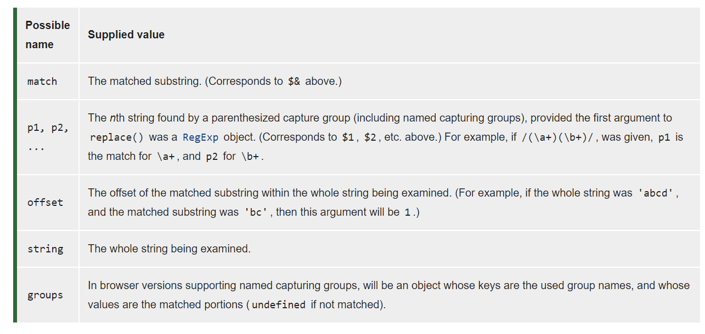

### 1.String Object

#### 1.match

If you need to know if a string matches a regular expression [`RegExp`](https://developer.mozilla.org/en-US/docs/Web/JavaScript/Reference/Global_Objects/RegExp), use [`RegExp.test()`](https://developer.mozilla.org/en-US/docs/Web/JavaScript/Reference/Global_Objects/RegExp/test).

```javascript
const str = 'For more information, see Chapter 3.4.5.1';
const re = /see (chapter \d+(\.\d)*)/i;
const found = str.match(re);

console.log(found);

// logs [ 'see Chapter 3.4.5.1',
//        'Chapter 3.4.5.1',
//        '.1',
//        index: 22,
//        input: 'For more information, see Chapter 3.4.5.1' ]

// 'see Chapter 3.4.5.1' is the whole match.
// 'Chapter 3.4.5.1' was captured by '(chapter \d+(\.\d)*)'.
// '.1' was the last value captured by '(\.\d)'.
// The 'index' property (22) is the zero-based index of the whole match.
// The 'input' property is the original string that was parsed.

const str = 'ABCDEFGHIJKLMNOPQRSTUVWXYZabcdefghijklmnopqrstuvwxyz';
const regexp = /[A-E]/gi;
const matches_array = str.match(regexp);

console.log(matches_array);
// ['A', 'B', 'C', 'D', 'E', 'a', 'b', 'c', 'd', 'e']

const paragraph = 'The quick brown fox jumps over the lazy dog. It barked.';

const capturingRegex = /(?<animal>fox|cat) jumps over/;
const found = paragraph.match(capturingRegex);
console.log(found.groups); // {animal: "fox"}

```

#### 2.matchAll()

```javascript
let regexp = /t(e)(st(\d?))/g;
let str = 'test1test2';

str.match(regexp); 
// Array ['test1', 'test2']


let array = [...str.matchAll(regexp)];
array[0];
// ['test1', 'e', 'st1', '1', index: 0, input: 'test1test2', length: 4]
array[1];
// ['test2', 'e', 'st2', '2', index: 5, input: 'test1test2', length: 4]

```

#### 3.replace

```javascript
str.replace(RegExp, function(match,$1..., offset, string){} )
```


