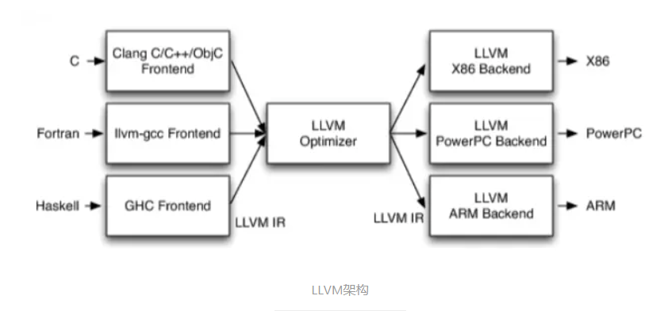

#### 1.LLVM

LLVM项目是模块化和可重用的编译器和工具链技术的集合。

LLVM提供了一套适合编译器系统的[中间语言](https://zh.wikipedia.org/wiki/中間語言)（Intermediate Representation，IR），有大量变换和优化都围绕其实现。经过变换和优化后的中间语言，可以转换为目标平台相关的[汇编语言](https://zh.wikipedia.org/wiki/汇编语言)代码。

##### 1.传统的编译器架构

1. **Frontend:前端**

   词法分析、语法分析、语义分析、生成中间代码

2. **Optimizer:优化器**

   中间代码优化

3. **Backend:后端**

   生成机器码

##### 2.LLVM框架

### 2.沙箱机制

### 3.JIT

### 4. parser

1. 主要作用是进行语法分析，提取出句子的结构。

   输入程序源代码，输出语法树（syntax tree）或者抽象语法树(abstract syntax tree, AST)。

   > javascript转译、代码压缩、css预处理器、elint、pretiier 等工具建立在AST上。

2. 解析器的工作流程

   

### 5.解释器 interpreter

1. 什么是解释器？

   解释器是一种[程序](https://zh.wikipedia.org/wiki/计算机程序)，能够把[编程语言](https://zh.wikipedia.org/wiki/程式語言)一行一行解释运行。解释器像是一位“中间人”，每次运行程序时都要先转成另一种语言再作运行，因此解释器的程序运行速度比较缓慢。它不会一次把整个程序翻译出来，而是每翻译一行程序叙述就立刻运行，然后再翻译下一行，再运行，如此不停地进行下去。

### 6.编译器compiler

1. 什么是编译器？

   编译器是一种计算机程序，它会将某种编程语言写成的[源代码](https://zh.wikipedia.org/wiki/原始碼)（原始语言）转换成另一种编程语言（目标语言）。

2. 一个现代编译器的主要工作流程：

   [源代码](https://zh.wikipedia.org/wiki/源代码)（source code）→ [预处理器](https://zh.wikipedia.org/wiki/预处理器)（preprocessor）→ [编译器](https://zh.wikipedia.org/wiki/编译器)（compiler）→ [汇编程序](https://zh.wikipedia.org/wiki/汇编程序)（assembler）→ [目标代码](https://zh.wikipedia.org/wiki/目标代码)（object code）→ [链接器](https://zh.wikipedia.org/wiki/链接器)（linker）→ [可执行文件](https://zh.wikipedia.org/wiki/執行檔)（executables），最后打包好的文件就可以给电脑去判读运行了。

